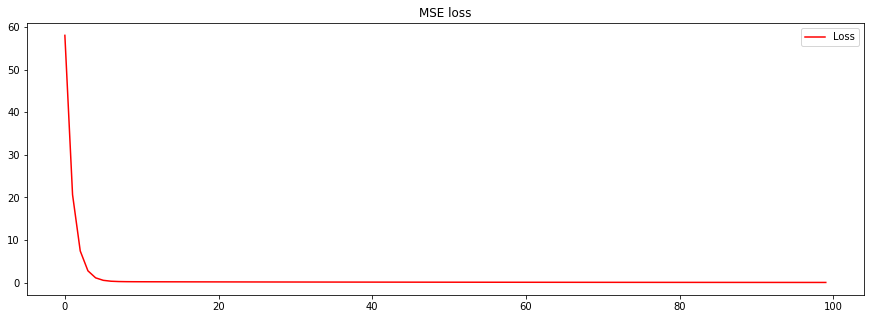
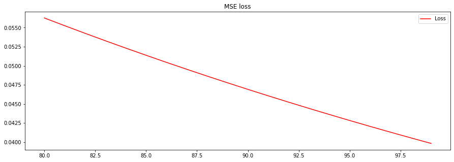

# Introduction


A simple Linear regression model is:

<center>

</center>

where,
*  is the input (Independent Variable)
*  is the output (Dependent Variable

For example,

<center>

<center>Figure 1: Example of a regression data</center>
</center>


Let's map the relationship between  and   in Figure 1 using TensorFlow and let the neural network figure out the relationship between    and .


```python
import numpy as np
import tensorflow as tf
```

Let's first take the data in an array.


```python
xs = np.array([-1.0, 2.0, 5.0, 7.0 ], dtype=float)
ys = np.array([-1.0, 5.0, 11.0, 15.0], dtype=float)
```

First, let's Built a Sequential Model that has a Dense layer with 1 Neuron. The input shape is [1] because the input on the Model  is a one-dimensional array.


```python
model = tf.keras.Sequential([tf.keras.layers.Dense(units=1, input_shape=[1])])
```

After creating a model, you must call its `compile()` method to specify the loss function and the optimizer to use.
There are other optional parameters that you can pass during training and evaluation. 

For the above-defined regression model, let's define `optimizer and loss.` 


```python
model.compile(optimizer = 'sgd', loss = 'mean_squared_error')
```

The "sgd" optimizer means that the model will be trained using a simple Stochastic Gradient Descent algorithm. 


```python
history = model.fit(xs, ys, epochs=100)
```

    Epoch 1/100
    1/1 [==============================] - 0s 205ms/step - loss: 58.0701
    Epoch 2/100
    1/1 [==============================] - 0s 11ms/step - loss: 20.6445
    Epoch 3/100
    1/1 [==============================] - 0s 4ms/step - loss: 7.4344
    Epoch 4/100
    1/1 [==============================] - 0s 5ms/step - loss: 2.7698
    ............................................................
    Epoch 90/100
    1/1 [==============================] - 0s 8ms/step - loss: 0.0478
    Epoch 91/100
    1/1 [==============================] - 0s 5ms/step - loss: 0.0469
    Epoch 92/100
    1/1 [==============================] - 0s 6ms/step - loss: 0.0461
    Epoch 93/100
    1/1 [==============================] - 0s 8ms/step - loss: 0.0452
    Epoch 94/100
    1/1 [==============================] - 0s 6ms/step - loss: 0.0444
    Epoch 95/100
    1/1 [==============================] - 0s 6ms/step - loss: 0.0436
    Epoch 96/100
    1/1 [==============================] - 0s 4ms/step - loss: 0.0428
    Epoch 97/100
    1/1 [==============================] - 0s 6ms/step - loss: 0.0421
    Epoch 98/100
    1/1 [==============================] - 0s 6ms/step - loss: 0.0413
    Epoch 99/100
    1/1 [==============================] - 0s 4ms/step - loss: 0.0406
    Epoch 100/100
    1/1 [==============================] - 0s 5ms/step - loss: 0.0398


We have successfully trained the regression model. Let's predict the value of  when  = 10.


```python
model.predict([10])
```


    array([[21.19831]], dtype=float32)


The value  is 21.14. 

## How to find the value of  and ?

Before looking at the value of  and , let's first see the layers inside the model.


```python
model.layers
```


    [<tensorflow.python.keras.layers.core.Dense at 0x7fcf12650bd0>]


There is only one dense layer inside the model. Therefore, we can take the first layer in an array and find its weight to get the value of  and .


```python
model.layers[0].get_weights()
```


    [array([[2.0488167]], dtype=float32), array([0.71014404], dtype=float32)]


The value of 
If we apply the model computed value of  and  in Figure 1 data. The model output is not completely accurate. 

### Should we train the model for more epochs? 

Yes, we should train the model for more epochs, and I will tell you why?


Let's first plot the loss of the model.


```python
import matplotlib.pyplot as plt
loss = history.history['loss']
epochs = range(len(loss))
plt.figure(figsize=(15,5))
plt.plot(epochs, loss, 'r', label='Loss')
plt.title('MSE loss')
plt.legend()
plt.figure()
```


    <Figure size 432x288 with 0 Axes>


    



The loss seems to be constant after eight epochs. To look at a bigger picture, let's zoom in on the loss after 90 epochs.


```python
import matplotlib.pyplot as plt
loss = history.history['loss']
epochs = range(len(loss))
plt.figure(figsize=(15,5))
plt.plot(epochs[90:], loss[90:], 'r', label='Loss')
plt.title('MSE loss')
plt.legend()
plt.figure()
```





The zoomed-in picture of loss shows that the loss is sharply decreasing, and it is not constant. Therefore training a model with more epochs will create more accurate results.

### How many epochs to run when training a model and how to know when to stop?

Tensorflow provides a callbacks mechanism to customize the behavior of a Keras model during training, evaluation, or inference. It means we can monitor model training and evaluation and store the best model using the callbacks.

For this model, we need to stop early if the loss increases and save the model at its optimal state, i.e., we need a ModelCheckPoint that monitors loss and keeps the best model -- model having lower loss among all.

Let's implement these two functionalities.


```python
model_check_point = tf.keras.callbacks.ModelCheckpoint('regression_model.h5', monitor='loss',save_best_only=True)
early_stop = tf.keras.callbacks.EarlyStopping('loss', patience=5)
```

The `model_check_point` monitors the loss and saves only that model that has a lower loss. The early stop helps to track the loss of the model. If the loss increases, the  `EarlyStopping` will wait for the five additional epochs from the lowest loss. If it is still rising, the model stops training and saves the best model, i.e., the `ModelCheckPoint ` will store the model having the lowest loss.


```python
callbacks = [early_stop, model_check_point]
```

Let's train the model up to 1500 epochs.


```python
model = tf.keras.Sequential([tf.keras.layers.Dense(units=1, input_shape=[1])])
model.compile(optimizer = 'sgd', loss = 'mean_squared_error')
model.fit(xs, ys, epochs=1500, callbacks = callbacks)
```

    Epoch 1/1500
    1/1 [==============================] - 0s 198ms/step - loss: 106.3459
    Epoch 2/1500
    1/1 [==============================] - 0s 4ms/step - loss: 37.6420
    Epoch 3/1500
    1/1 [==============================] - 0s 4ms/step - loss: 13.3944
    .......................................................
    Epoch 1323/1500
    1/1 [==============================] - 0s 8ms/step - loss: 1.0473e-11
    Epoch 1324/1500
    1/1 [==============================] - 0s 17ms/step - loss: 1.0473e-11
    Epoch 1325/1500
    1/1 [==============================] - 0s 9ms/step - loss: 9.8481e-12
    Epoch 1326/1500
    1/1 [==============================] - 0s 12ms/step - loss: 9.8481e-12
    Epoch 1327/1500
    1/1 [==============================] - 0s 12ms/step - loss: 9.8481e-12
    Epoch 1328/1500
    1/1 [==============================] - 0s 7ms/step - loss: 9.8481e-12
    Epoch 1329/1500
    1/1 [==============================] - 0s 6ms/step - loss: 9.8481e-12
    Epoch 1330/1500
    1/1 [==============================] - 0s 18ms/step - loss: 9.8481e-12


    <tensorflow.python.keras.callbacks.History at 0x7fcf0a4c8e50>


The model training stopped around 1330 epochs. 

We can load the saved model and see the weights associated with it.


```python
loaded_model = tf.keras.models.load_model('regression_model.h5')
```


```python
loaded_model.layers[0].get_weights()
```


    [array([[2.000001]], dtype=float32), array([0.9999955], dtype=float32)]


The value of  and . 

Training for additional epochs increased the accuaray of the model. Let's predict the value when .


```python
loaded_model.predict([10])
```


    array([[21.000006]], dtype=float32)


You can directly use a trained model to predict the value.


```python
model.predict([10])
```


    array([[21.000006]], dtype=float32)


# Conclusion

The relationship between  and  in the figure 1 is  
<center>

</center>

# References

[1] Moroney, L. (2020). Ai and machine learning for coders. " O'Reilly Media, Inc.".


```python

```