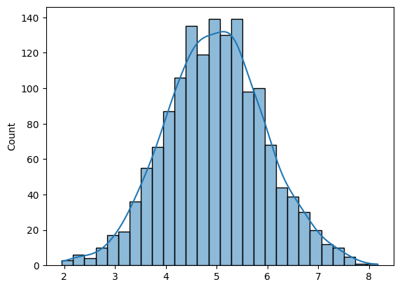
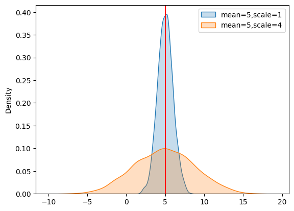
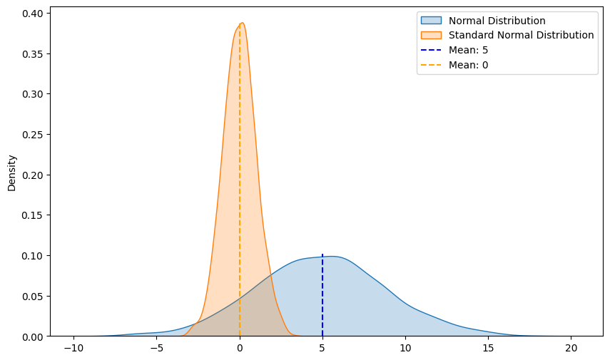

## Mean

The mean, often referred to as the average, is a measure of central tendency that summarizes a set of values into a single number. It represents the central point of the dataset and is calculated by dividing the sum of all values by the number of values in the dataset.

Formula:

$$
\mu = \frac{\sum_{i=1}^n x_i}{n}
$$


```python
import numpy as np
d1 = np.arange(1, 6)
d1
```


    array([1, 2, 3, 4, 5])


```python
mu = np.mean(d1)
print("Mean = ", mu) # center value is 3
```

    Mean =  3.0


```python
d2 = np.full(shape=(5,), fill_value=3)
d2
```


    array([3, 3, 3, 3, 3])


```python
mu = np.mean(d2)
print("Mean = ", mu) # center value is 3
```

    Mean =  3.0


Although both datasets have the same mean, their values are distributed very differently. `d2` has no variability, while `d1` has variability. It means $\mu$ does not reflect distribution, i.e. mean does not give information about the spread or distribution of the data.

## Spread of Data Measurement using Standard Deviation

Standard deviation measures the spread of the data points around the mean.

### Population Standard Deviation

$$
\sigma = \sqrt{\frac{1}{N} \sum_{i=1}^N (x_i - \mu)^2}
$$

### Sample Standard Deviation
$$
s = \sqrt{\frac{1}{n-1} \sum_{i=1}^n (x_i - \overline{x})^2}
$$

## Normal Distribution

In probability theory and statistics, a normal distribution or Gaussian distribution is a type of continuous probability distribution for a real-valued random variable aka continuous random variable. The general form of its probability density function is
<center>

</center>

The parameter ${\textstyle \mu }$ is the mean or expectation of the distribution, while the parameter ${\textstyle \sigma ^{2}}$ is the variance. The standard deviation of the distribution is ${\textstyle \sigma }$. A random variable with a Gaussian distribution is said to be normally distributed if it has mean $\mu$ and variance $\sigma^2.$

Let's create a normal distribution and visualize it.


```python
import seaborn as sns
np.random.seed(0)
x = np.random.normal(loc=5, scale=1, size=1500) # loc = mean, scale = standard deviation
sns.histplot(x, kde=True)
```


    
    

    


The shape of Normal distribution is defined by Mean and Standard Deviation

* The mean (μ) determines the center of the distribution.
* The standard deviation (σ) determines the spread of the distribution.

## Experimenting with Normal Distributions: Same Mean, Different Standard Deviations

This experiment will visualize the impact of standard deviation on normal distributions. We'll start with the same mean for our datasets and alter the standard deviation values to see how it changes the shape and spread of the bell curve.

By the end of this experiment, you'll have a clearer understanding of why standard deviation is crucial in data analysis and how it affects the distribution of data around the mean.


```python
import matplotlib.pyplot as plt
np.random.seed(0)
# loc = mean, scale = standard deviation
d1 = np.random.normal(loc=5, scale=1, size=1500)
d2 = np.random.normal(loc=5, scale = 4, size = 1500)
sns.kdeplot(d1, fill=True, label='mean=5,scale=1')
sns.kdeplot(d2, fill=True, label='mean=5,scale=4')
plt.axvline(5, color='red')
plt.legend()
plt.show()plt.axvline(mean_value, color='r', linestyle='--', label=f'Mean: {mean_value:.2f}', xmin=0.3, xmax=0.7)
```


    
    

    


A low standard deviation indicates that the data points tend to be close to the mean, while a high standard deviation indicates that the data points are spread out over a wider range of values. This is crucial for understanding the overall distribution of the data.

## Emperical Rule or 68-95-99.7 Rule:


src: https://hyperskill.org/learn/step/24676


This rule, also known as the empirical rule, states that for a normal distribution:

* Approximately 68% of the data falls within one standard deviation (μ±σ) of the mean.
* Approximately 95% of the data falls within two standard deviations (μ±2σ) of the mean.
* Approximately 99.7% of the data falls within three standard deviations (μ±3σ) of the mean.

## Difference between Normal and Standard Normal distribution

Normal Distribution
* mean = $\mu$
* variance = $\sigma^2$

Standard Normal distribution
* mean = 0
* variance = 1

The Z-Score is a crucial concept used to convert a Normal Distribution to a Standard Normal Distribution through a process called standardization. This technique, also used in Machine Learning for feature scaling, transforms data to have a mean of 0 and a standard deviation of 1.

$z-score = \frac{x_i-\mu}{\sigma}$

Understanding these distributions and their transformations is fundamental in statistical analysis and data preprocessing tasks.


```python
from scipy.stats import zscore
np.random.seed(0)
normal_dist = np.random.normal(loc=5, scale = 4, size = 1500) # normal distribution
standard_normal_dist = zscore(normal_dist)
plt.figure(figsize=(10, 6))
sns.kdeplot(normal_dist, fill=True, label='Normal Distribution')
sns.kdeplot(standard_normal_dist, fill=True, label='Standard Normal Distribution')
plt.axvline(5, color='b', linestyle='--', label=f'Mean: {5}', ymin=0, ymax=0.25)
plt.axvline(0, color='orange', linestyle='--', label=f'Mean: {0}', ymin=0, ymax=0.95)
plt.legend()
plt.show()
```


    


