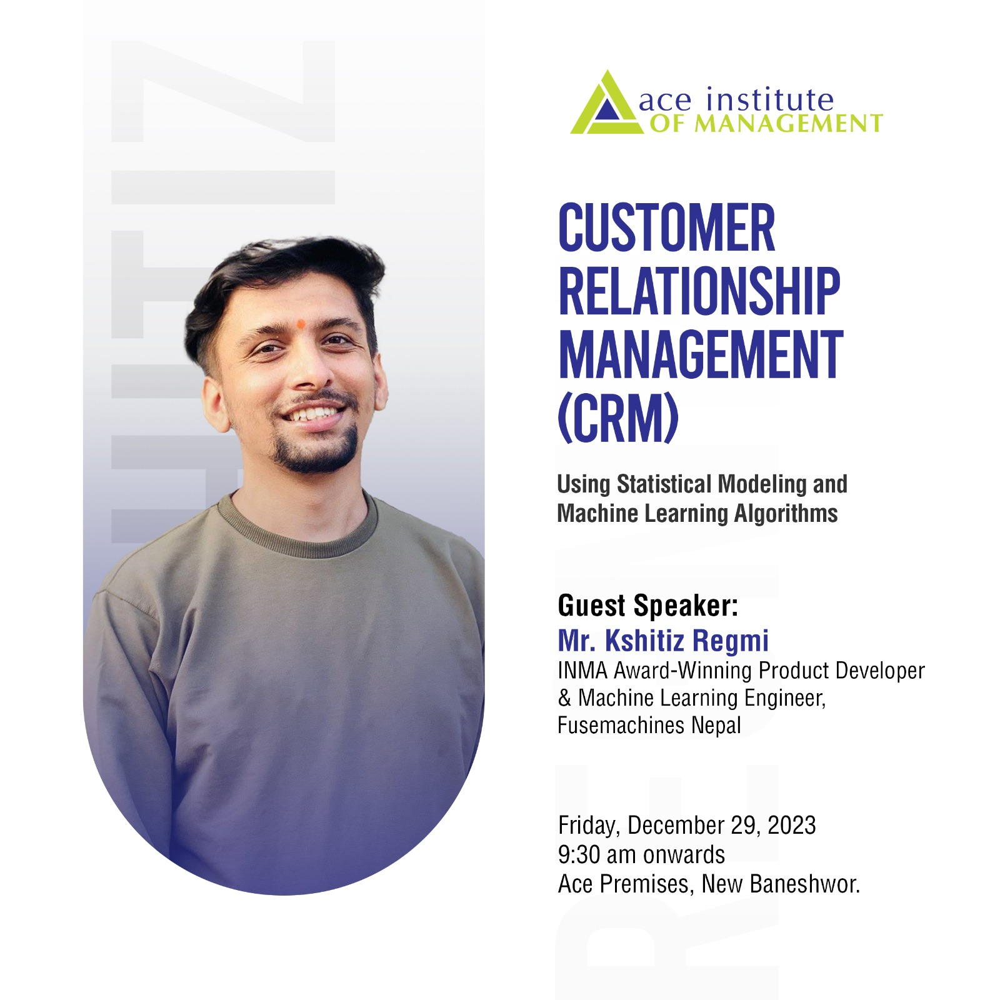
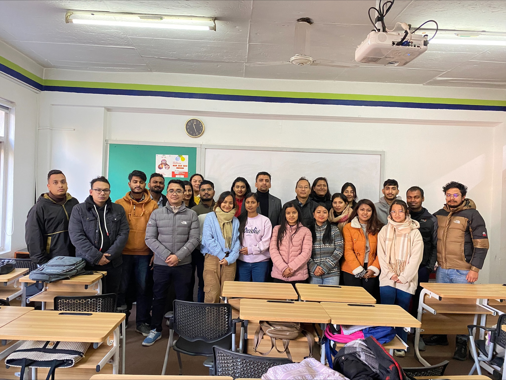
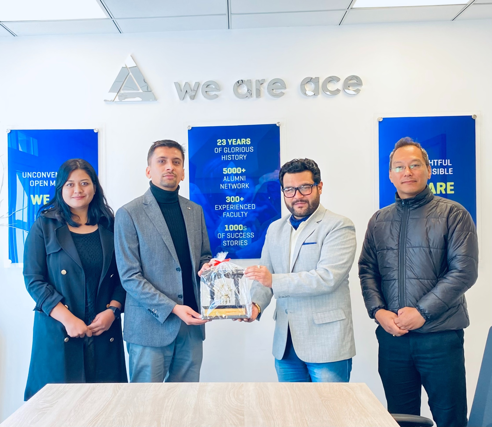

One of the major objectives of Marketing is creating a long-lasting relationship with the customers. Customer Relationship Management (CRM) has been a revolutionary tool in the same realm trying to bring out the best in the marketing industry.

