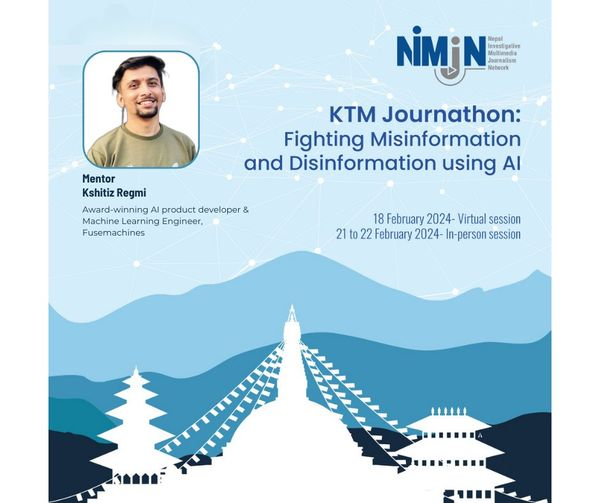
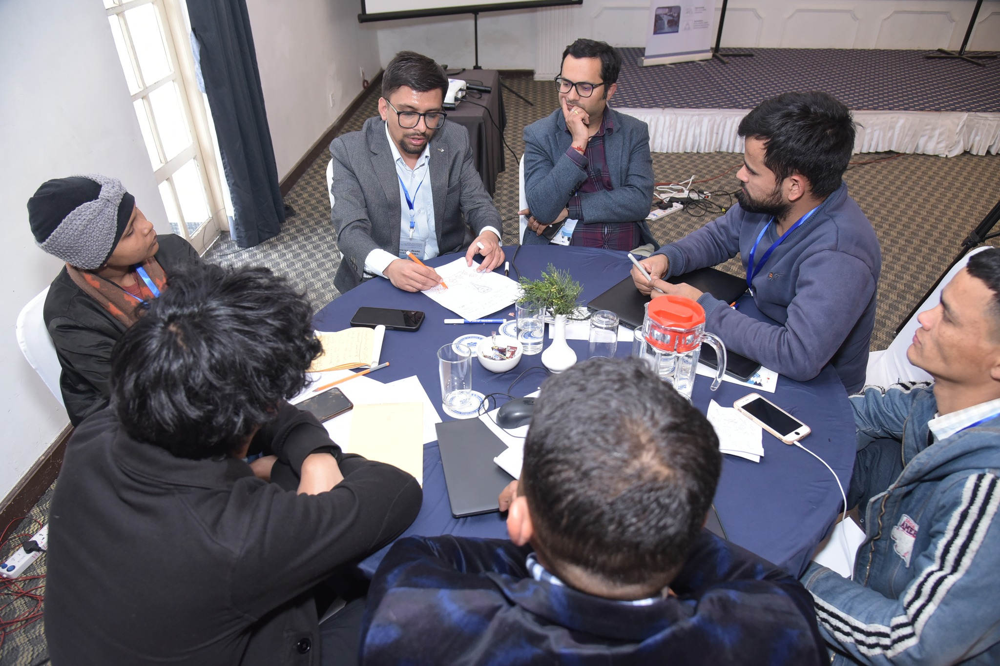
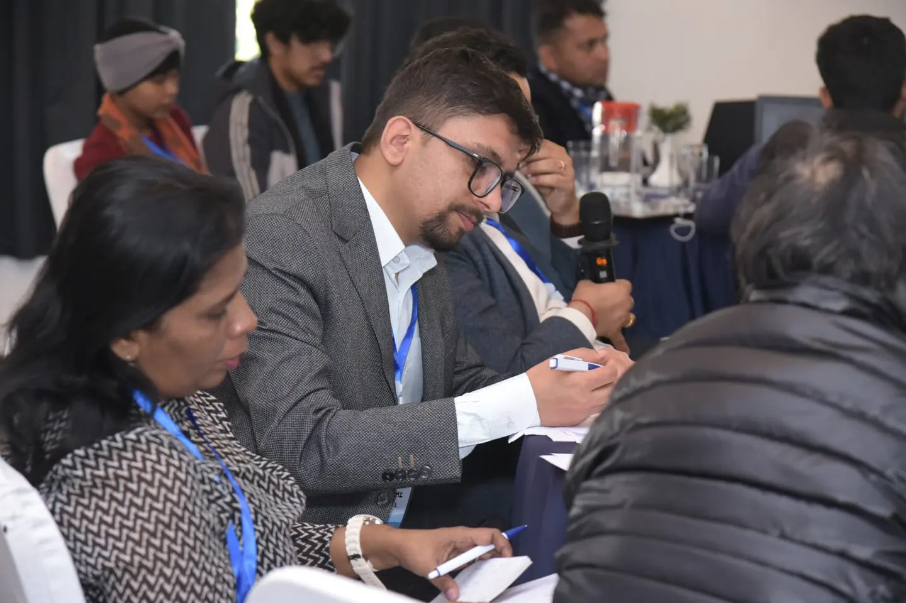
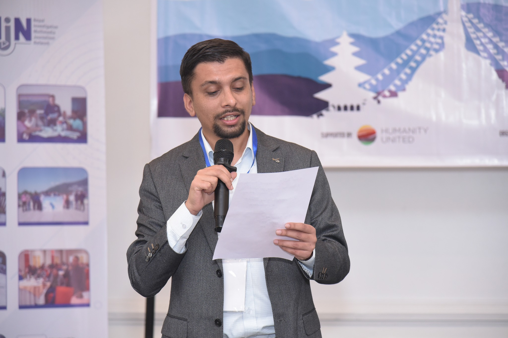
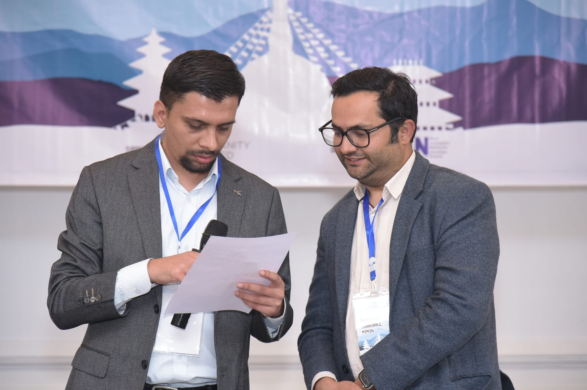
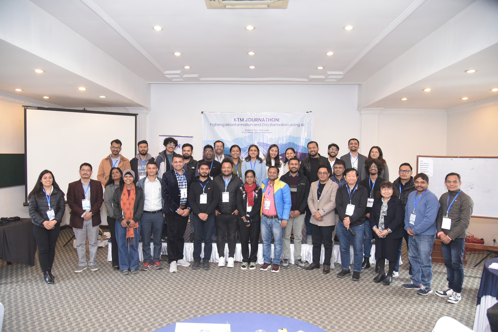

KTM Journathon Looks at Solutions to Tackle Misinformation and Disinformation Using AI Kathmandu, Nepal (February 23, 2024) – Nepal Investigative Multimedia Journalism Network (NIMJN), organized a two and a half-day KTM Journathon to tackle misinformation and disinformation using AI. KTM Journathon brought together national and international participants from journalism, IT, and other sectors to work in multidisciplinary groups to fight against misinformation and disinformation collaboratively by leveraging AI tools and techniques. KTM Journathon was held on Feb 18 (virtually), and on Feb 21 and Feb 22nd as an in-person event in Kathmandu. A Journathon is a hackathon where tech enthusiasts and professionals collaborate with journalists and come up with innovative solutions to various pressing issues.

