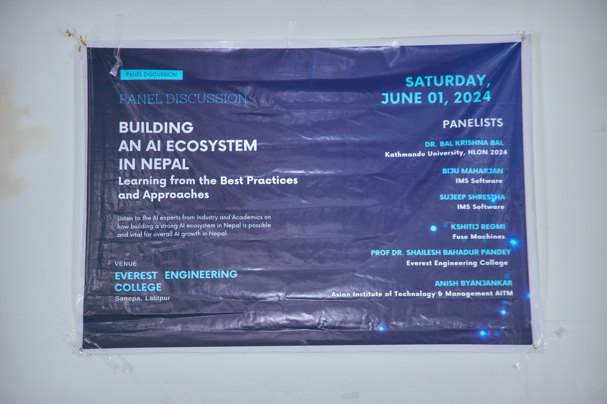

The session featured Prof. Dr. Bal Krishna Bal (Kathmandu University) and Prof. Dr. Shailesh Bahadur Pandey (Everest Engineering College, Pokhara University) discussing "Building an AI Ecosystem in Nepal: Learning from Best Practices and Approaches." I highlighted how AI education can play a crucial role in developing Nepal's AI ecosystem by cultivating collaboration among the government, private organizations, universities, students, and civil society to establish a cohesive AI chain.