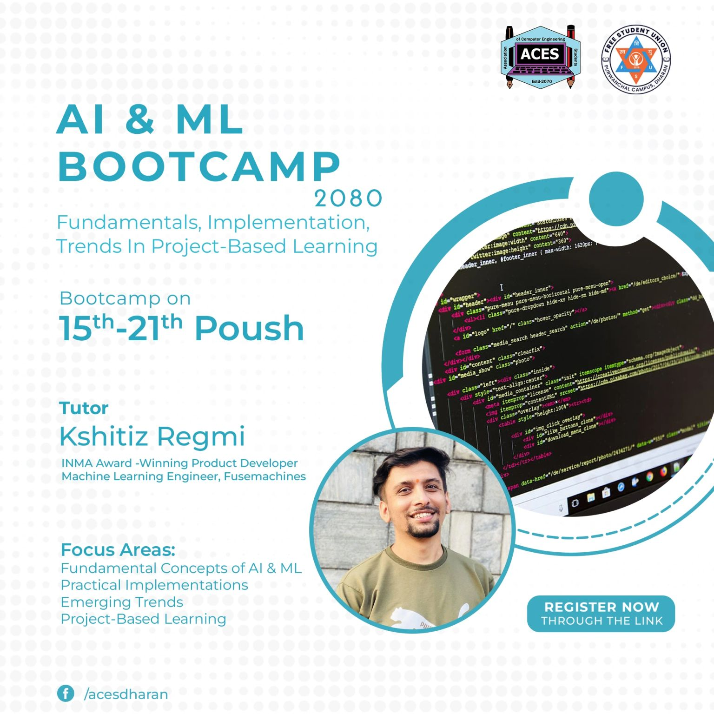
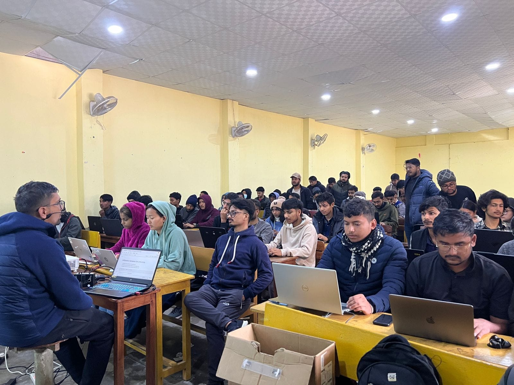
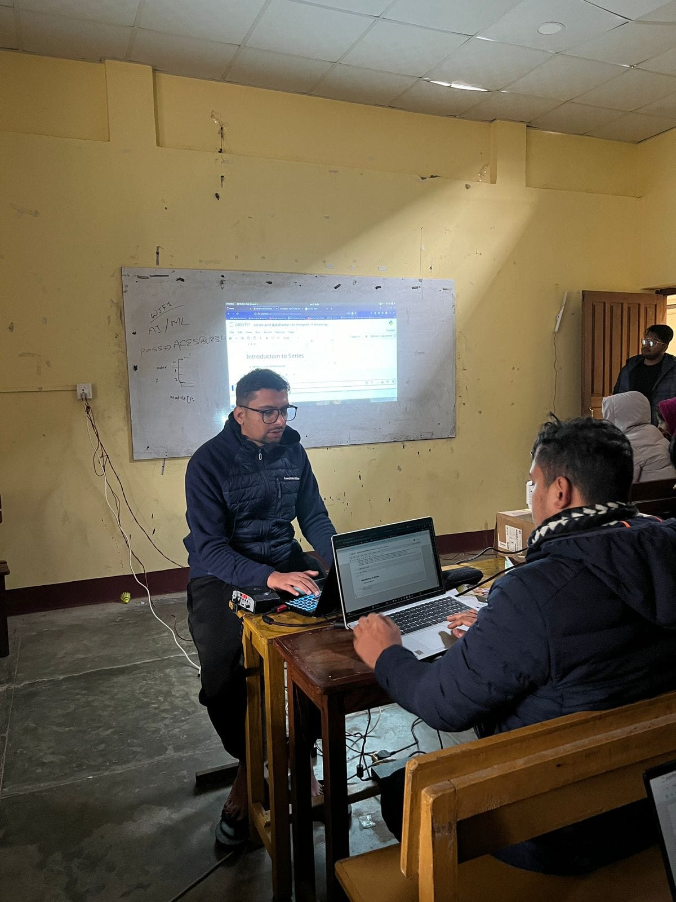
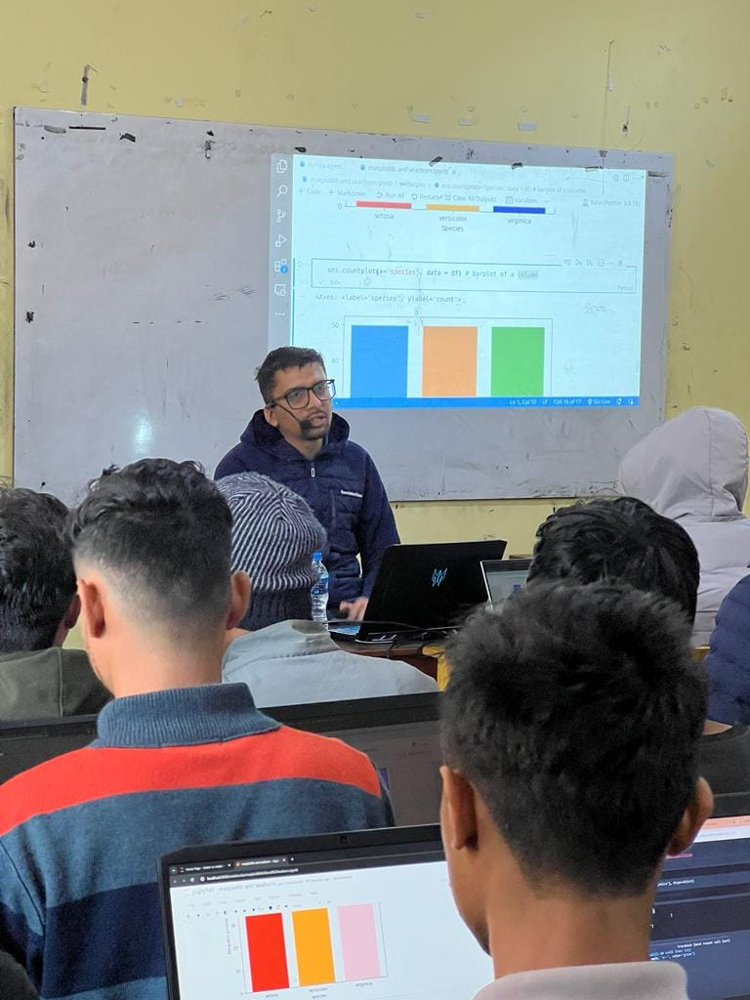
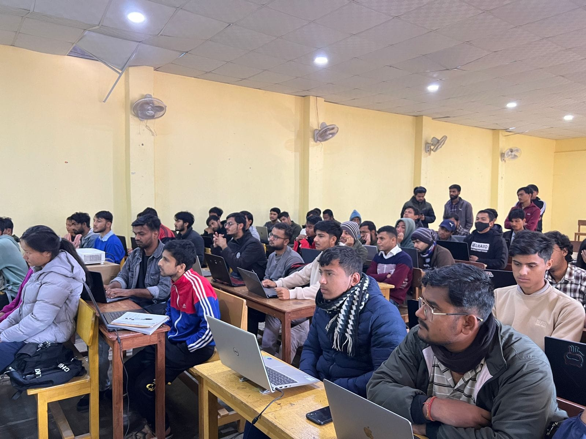
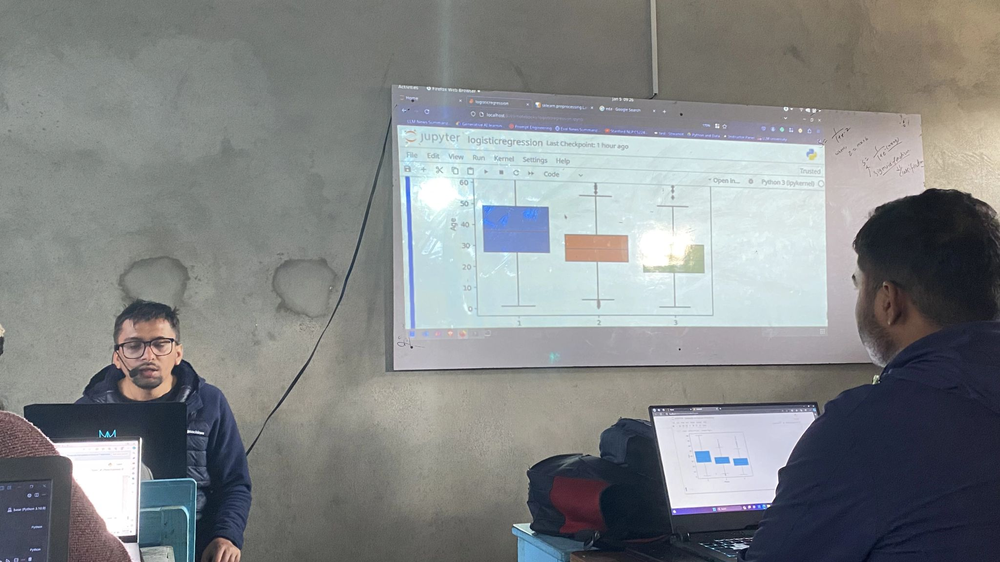
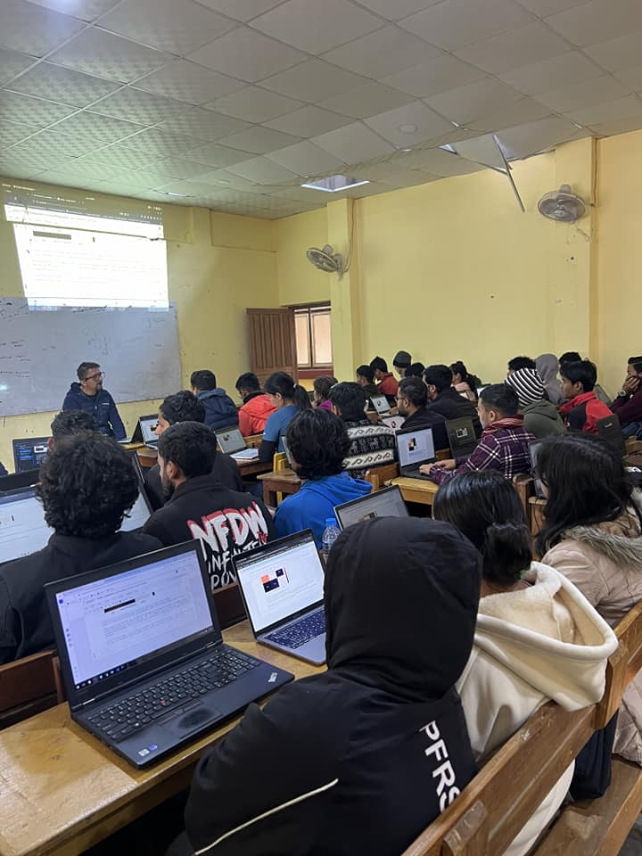
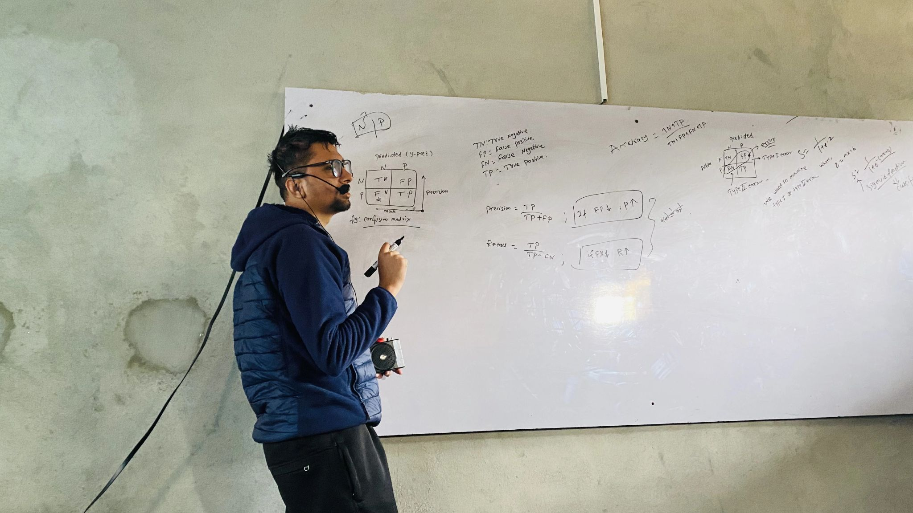
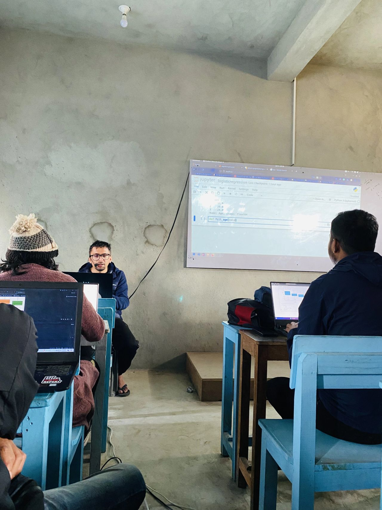
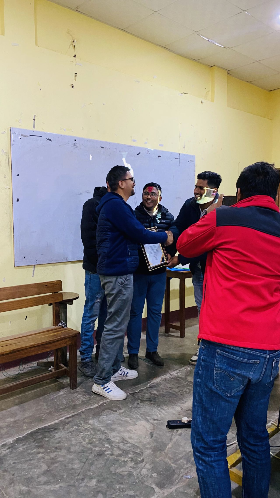

[More](https://www.linkedin.com/posts/kshitizregmi_as-a-tutor-im-thrilled-to-share-that-i-activity-7149789327433048064-2qjz)

As a tutor, I'm thrilled to share that I recently led a dynamic 7-day AI/ML bootcamp at Tribhuvan University, IOE, Purwanchal Campus . Throughout the program, participants delved into practical, hands-on training within a comprehensive learning environment, resulting in their successful completion. It was a rewarding experience witnessing their growth. Thank you everybody who directly or indirectly helped to make it successful. 🙏 

## Day 1: Kicking of AI/ML session on Numpy
<!-- 

 -->

## Day 2:  Introducing Pandas, uncovering Series, DataFrames
<!-- 

 -->

## Day 3: Day 3 of AI/ML Bootcamp:  Exploring Matplotlib, Seaborn and Plotly for EDA

<!-- 

 -->

## Day 4 of AI/ML Bootcamp: Diving into Machine Learning basics, exploring types, introducing supervised/unsupervised learning, and understanding the ML workflow

<!-- 

 -->

## Day 5 of AI/ML Bootcamp: Delving into Regression algorithm

Predicting employee salaries. Covering data integration, preprocessing, feature engineering and selection, model training, and evaluation metrics for regression models.

<!-- 

 -->

## Day 6 of AI/ML Bootcamp: Classification Algorithms

Delved into Logistics Regression, SVM, Decision Tree, and Random Forest. Explored evaluation metrics and decision boundaries for these models
<!-- 

 -->

## Closing a week-long AI & ML bootcamp with ACES on a high note

Mastering Decision Trees, Random Forests, and K-Means Clustering

<!-- 

 -->

